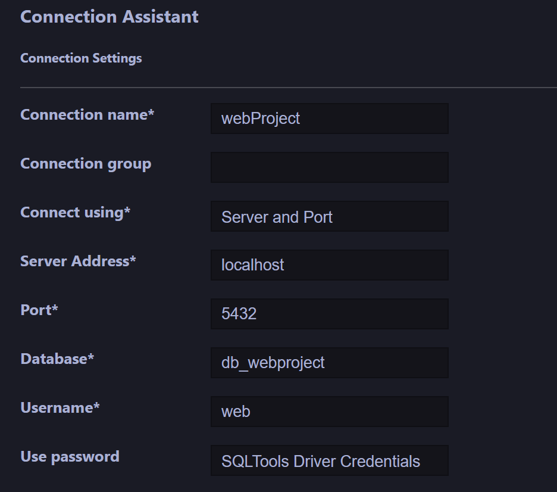

# CIR2_WebProject

## Database creation :

- Connect to WSL debian
    - `cd /var/www/html/CIR_WebProject`
    - `sudo service apache2 start`
    - `sudo service postgresql start`
- Connect to postgreSQL superUser     
    - `sudo -u postgres psql`
- Create role and DB from postgreSQL prompt    
    - `create role web login password 'password';`
    - `create database db_webproject owner postgres;`
- Exit postgreSQL to Debian    
    - `\q`
- Connect to database with superUser  
    - `psql db_webproject postgres`
- Create tables 
    - `\i createDB.sql`    
- Give rights to user web    
    - `grant insert, update, select, delete on all tables in schema public to web;`
- Exit postgresql    
    - `\q`
- Test :
    - `psql db_webproject web`
    - `INSERT INTO public.user VALUES('charles.ottofraises@messagerie.fr', 'Ottofraises', 'Charles', 'test', '11/04/2023 15:30:00.000', '0612345686');`

## VSCode DB link setup :
- Add new connection & fill as here : 

- Test connection and enter password 'password'
- If succeed, save connection
